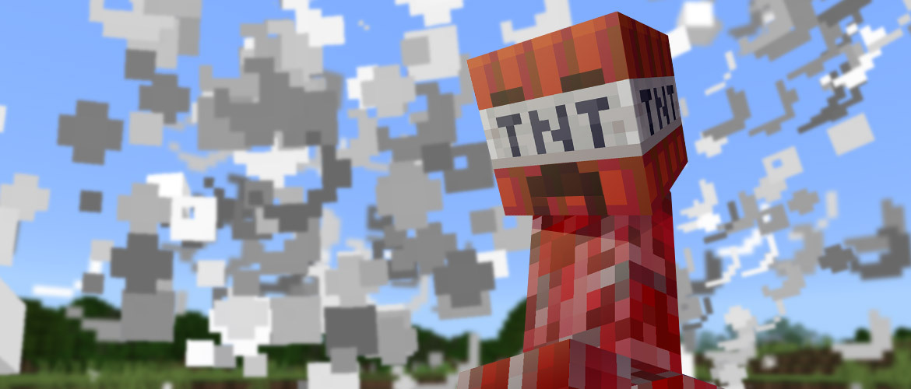

## Introdução ao desenvolvimento de add-on para Bedrock Edition

Complementos são o primeiro passo em nossa jornada para trazer níveis ainda maiores de personalização para o Minecraft: Bedrock Edition. Add-Ons permitem que os jogadores transformem a aparência de seus mundos e até mesmo mudem


Neste tutorial, você aprenderá o seguinte.

* A estrutura de arquivo usada para Minecraft
* O software é usado para editar arquivos JSON.
* Extensões disponíveis para ajudar no desenvolvimento de complementos.

## com.mojang
Quando o Minecraft é instalado em seu computador, há um diretório de pasta chamado **com.mojang** que é gerado na pasta AppData. Para acessar esta pasta, você pode usar a seguinte solução para localizar

Para localizar a pasta **com.mojang** no Windows, você precisará definir os **ítens ocultos** como **verdadeiro** selecionando a **caixa de seleção** conforme mostrado abaixo.

Para habilitar **Exibir Itens Ocultos**

* Abra o **Explorador de arquivos** na barra de tarefas.
* Selecione **Exibir > Opções > Alterar pasta e opções de pesquisa**.
* Selecione a guia **Exibir** e, em **Configurações avançadas**, selecione **Mostrar arquivos, pastas e unidades ocultas** e OK.


## Localizando com.mojang
* Pressione **Win + R** para abrir **Executar**. Como alternativa, você pode iniciar **Executar** no menu inicial.
* Copie e cole o seguinte:
`%localappdata%\Packages\Microsoft.MinecraftUWP_8wekyb3d8bbwe\LocalState\games\com.mojang`
* Pressione **OK**.

Conforme mostrado na imagem abaixo, existem vários subdiretórios localizados na pasta com.mojang.

```
Se você vir mais conteúdo nesta pasta do que o mostrado acima, não entre em pânico! Esta imagem mostra uma nova instalação do Minecraft.
```

## Comportamento, skins e pacotes de recursos
Existem 3 pastas chamadas **behavior_packs**, **resource_packs** e **skin_packs**. Qualquer conteúdo personalizado que será adicionado ao Minecraft: Bedrock Edition virá na forma de um desses 3 pacotes.

## Pacotes de Desenvolvimento
Junto com as 3 pastas de pacotes, também existem versões de desenvolvimento dessas pastas. Pacotes de desenvolvimento são pacotes que são atualizados toda vez que o Minecraft é iniciado, permitindo que você carregue e teste rapidamente as alterações feitas em seus pacotes.

## minecraftWorlds
**minecraftWorlds** contém cada mundo que foi gerado na compilação atual do Minecraft. Cada pasta também conterá pastas de pacote de recursos e comportamento para conter quaisquer pacotes que possam estar em uso no mundo.

```
É recomendado que, ao instalar uma nova versão do Minecraft, você salve uma cópia desta pasta para usar como backup, a fim de evitar qualquer perda potencial de mundos do Minecraft que você possa ter.
```

## Visual Studio Code
Siga o link aqui para instalar o <a href="https://code.visualstudio.com/Download">Visual Studio Code</a>

## Instalando Visual Studio Code
O Visual Studio Code oferece suporte a extensões criadas pela comunidade de desenvolvedores do Visual Studio Code. As extensões são uma ótima maneira de ajudar a escrever e entender a sintaxe do Minecraft ao trabalhar em pacotes de recursos e comportamentos.

## Instalando extensões
* Clique no link fornecido para baixar <a href="https://marketplace.visualstudio.com/items?itemName=destruc7i0n.vscode-bedrock-definitions">Definições de Bedrock</a> para Visual Studio Code.
* Clique no link fornecido para baixar o <a href="https://marketplace.visualstudio.com/items?itemName=BlockceptionLtd.blockceptionvscodeminecraftbedrockdevelopmentextension">Minecraft Bedrock Development</a> para Visual Studio Code da Blockception.

## Qual é o próximo?
Agora que seu ambiente de desenvolvimento está configurado, você pode começar a criar seu primeiro complemento aprendendo mais sobre pacotes de recursos.
* <a href="introduction-to-resource-packs">Pacotes de Recursos</a>

Alternativamente, se você gostaria de começar com comandos no Minecraft, vá para Introdução aos blocos de comando para aprender como usar blocos de comando para encadear diferentes comandos.

## Criadores
<table>
  <tr>
    <td align="center">
      <a href="https://github.com/MokuseiDev">
        <br />
       <sub><b>Mokusei</b></sub>
      </a>
    </td>
    <td align="center">
      <a href="https://github.com/GabrielAplok">
        <br />
       <sub><b>Gabriel Aplok</b></sub>
      </a>
    </td>
  </tr>
</table>

## Atenção
Este site não é afiliado da Mojang Studios ou da Microsoft de forma alguma.
